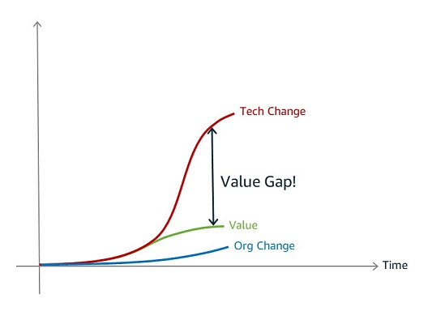
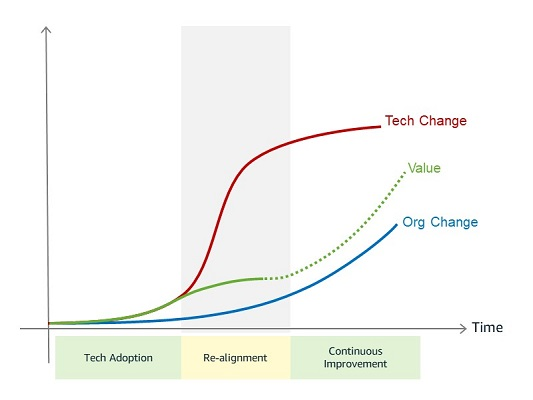

# Table of contents
This readme contains a summary of interesting blogs about cloud native
- [Table of contents](#table-of-contents)
- [Is Your Cloud Journey Stuck in the Value Gap?](#is-your-cloud-journey-stuck-in-the-value-gap)
  - [What is a value gap?](#what-is-a-value-gap)
  - [Common notes](#common-notes)
  - [How to overcome value gap?](#how-to-overcome-value-gap)
- [6 Strategies for Migrating Applications to the Cloud](#6-strategies-for-migrating-applications-to-the-cloud)
- [Your most important architecture decisions might be the ones you didn't know you made.](#your-most-important-architecture-decisions-might-be-the-ones-you-didnt-know-you-made)
- [Don't build an enterprise non-cloud!](#dont-build-an-enterprise-non-cloud)
  - [Cloud is not meeting expectations](#cloud-is-not-meeting-expectations)
  - [Enterprise leaking through cloud](#enterprise-leaking-through-cloud)
  - [Considerations](#considerations)
- [Is your platform a Fruit Basket or Fruit Salad?](#is-your-platform-a-fruit-basket-or-fruit-salad)
  - [Fruit basket](#fruit-basket)
  - [Fruit salad](#fruit-salad)
  - [Conclusion](#conclusion)

---

# Is Your Cloud Journey Stuck in the Value Gap?
> https://aws.amazon.com/blogs/enterprise-strategy/is-your-cloud-journey-stuck-in-the-value-gap/

## What is a value gap?

## Common notes
- Setting an unrealistically high bar will lead to frustration rather than better results.
- I occasionally still hear arguments that purchasing one large on-premises server is cheaper over three years than a corresponding cloud instance as calculated from the pricing sheet. If your IT organization makes financial comparisons without considering scaling up and down, hardware refreshes, backups, DR, and operational costs, for example, it will underestimate—and under-realize—the value of cloud.

## How to overcome value gap?
- Technical evolution and organizational evolution can feed each other in a virtuous cycle. more transparency, perhaps through better metrics, allows better decision-making and optimizing for value generated.
- From IT Proxy Metrics to Business Metrics
- From Broad to Deep. Like the game Battleship. In the beginning, you place a few exploratory probes somewhat randomly. Once you score a few hits, you develop a strategy to methodically probe for more insight.
- It is normal. Shifting gears in a car.

---

# 6 Strategies for Migrating Applications to the Cloud
> https://aws.amazon.com/blogs/enterprise-strategy/6-strategies-for-migrating-applications-to-the-cloud/

|Type|Description |
|-|-|
|Rehosting|Lift-and-shift. Can already save costs.Applications are easier to optimize/re-architect once they’re already running in the cloud |
|Replatforming|lift-tinker-and-shift.make a few cloud (or other) optimizations (like database) in order to achieve some tangible benefit, such as licensing costs|
|Repurchasing|Moving to a different product.|
|Refactoring / Re-architecting|Re-imagining how the application is architected and developed, typically using cloud-native features.|
|Retire|Get rid of. 20% of portfolio is no longer useful|
|Retain|do nothing|
  
---
  
# Your most important architecture decisions might be the ones you didn't know you made.
> https://architectelevator.com/architecture/important-decisions/
- The critical decision was already made
- Beware the Assumptions (lead to non-requirements, those requirements that exist but weren’t documented anywhere)
- Meaningless as most score cards in IT that represent the end of a long decision tree
- Conscious Decision Making

---

# Don't build an enterprise non-cloud!
> https://architectelevator.com/cloud/enterprise-non-cloud/

- Good intentions don’t always lead to good results.
- Be careful that your cloud doesn’t become yet another data center
- If you embrace cloud, you should embrace managed services
- If you move all the old junk to a new house, you’ll be living with the same junk.

## Cloud is not meeting expectations
- Sometimes moving to cloud without a clear strategy 
- It’s not a miracle cure that can magically solve all of IT’s ailments overnight
- Migrations leading to disappointment

## Enterprise leaking through cloud
The smells when an enterprise is leaking through the cloud 

|Smell|Explanation|NIST Definition|Conflict|
|-|-|-|-|
|Onboarding|Centralized billing,limit accounts,approvals lead to semi-manual sign-up process for project teams to “get to the cloud”|On-demand self-service|Lengthy sign-up processes contradict on-demand self-service|
|Hybrid Network|Applications running in the cloud communicate with those on premise|Broad network access. Access through standard mechanisms (not vpn)|Corporate network isn’t going to be quite as broad as the internet|
|Virtual Private Cloud|Dedicated host/instances|Resource pooling, different physical and virtual resources dynamically|Dedicated instances aren’t as widely pooled and have poorer economies of scale|
|Legacy Applications|They cannot applications easily scale out|Rapid elasticity|Traditional applications don’t benefit from rapid elasticity|
|Cost Recovery|IT adds an “overhead” charge to the existing cloud charges, additional fixed cost|Measured service, pay per use|high baseline cost charged from corporate IT makes the cloud a lot less “measured”|

## Considerations
- Calibrate Expectations. Cloud initiatives are started by rosy visions of cost savings and digital transformation. It behoove us to moderate these and set realistic expectations
- Bring cloud to you, not vice versa. Cloud isn’t a classic IT procurement, it’s a fundamental change in IT operating model. Instead, you need to bring some elements of the cloud operating model to your environment.
- Measurable Goals
- Segmentation. One cloud size doesn’t fit all. Perhaps for some applications, going straight to the cloud is actually OK, perhaps as long as billing isn’t on Jamie’s credit card.

---

# Is your platform a Fruit Basket or Fruit Salad?
> https://architectelevator.com/architecture/platforms-fruit-salad/
- IT platforms typically look like pyramids
- Pyramid’s wide base layer takes care of all common functions while business configuration sits on top almost like the cherry on the cake
- Huge effort required to lay the pyramid’s base layer makes it uneconomical

## Fruit basket
- Combine existing elements into a bigger piece
- All the customer gets is a fruit
- Those fruits can also be had directly from the vendor

## Fruit salad
- Prepared and packaged fruit salad
- Will be more opinionated

## Conclusion
- In fruit salad platform the pieces needs to be tightly integrated and automated
- Being more than the sum of the parts is particularly important as the cloud providers and other vendors aren’t standing 

