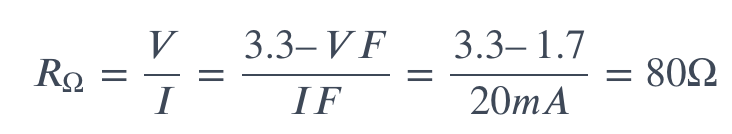

## Overview
|Wat|Engels|Eenheid|Synoniem|||
|-|-|-|-|-|-|
|Stroom|Current|Ampere|Coulomb per seconde|Hoeveel electrische lading (coulomb) zich per seconde verplaatst|Als we de kraan opendraaien, begint het water te stromen. De waterstroom is te vergelijken met elektrische ‘stroom’|
|Spanning|Voltage|Volt|Joule per coulomb|Hoeveel energie er vrijkomt bij het verplaatsen van een lading.Hoe meer druk hoe meer energie.|Als de kraan dicht is, drukt het water met een bepaalde kracht tegen de kraan. Die waterdruk wordt hoger als er meer water in het vat zit. Het is te vergelijken met ‘spanning’ als het om elektriciteit gaat|
|Weerstand|Resistance|Ohm||Limiteert de hoeveel stroom (electrische lading)|Als de kraan verder opengedraaid wordt, wordt de weerstand kleiner en gaat er meer water stromen.|
- Bij een elektrische stroomkring stroomt er, indien de kring gesloten is, elektrische lading van het ene naar het andere punt
- De hoeveelheid elektrische lading die per seconde door de stroomdraad beweegt, is de stroomsterkte (I)

## Watt
- Energie per seconde
- Joule per seconde
- Coulomb = Electrische lading
- Joule = Energie per lading
  
## Resistance for led
- A simple LED circuit consists of a LED and resistor. 
- The resistor is used to limit the current that is being drawn. 
- Without the resistor the LED would run at too high of a voltage, resulting in too much current being drawn which in turn would instantly burn the LED, and likely also the GPIO port on the Raspberry Pi

## Calculate resistance
- Forward voltage (VF) (aan de voorkant wat hij aankan)
- Forward current (IF) (aan de voorkant wat hij aankan)
- Need to know the output voltage of the Raspberry Pi which is 3.3V
  
  

Resources:
- https://www.zonnestroomnederland.nl/kennisbank/het-verschil-tussen-stroom-en-spanning/
- https://raspberrypihq.com/making-a-led-blink-using-the-raspberry-pi-and-python/

## Forward current/voltage
- In any 'loop' of a circuit, the voltages must balance: the amount generated = the amount used
- `Vi`: forward current: current we want to drive the LED at.
  - You can always give an LED less current. Running an LED near its rated maximum current gives you maximum brightness, at the cost of power dissipation (heat) and battery life
  - You cannot give more current (will destory led)
- `Vf`: forward voltage: Voltage consumed by the led. The rest of the voltage should be absorbed by the resistor
