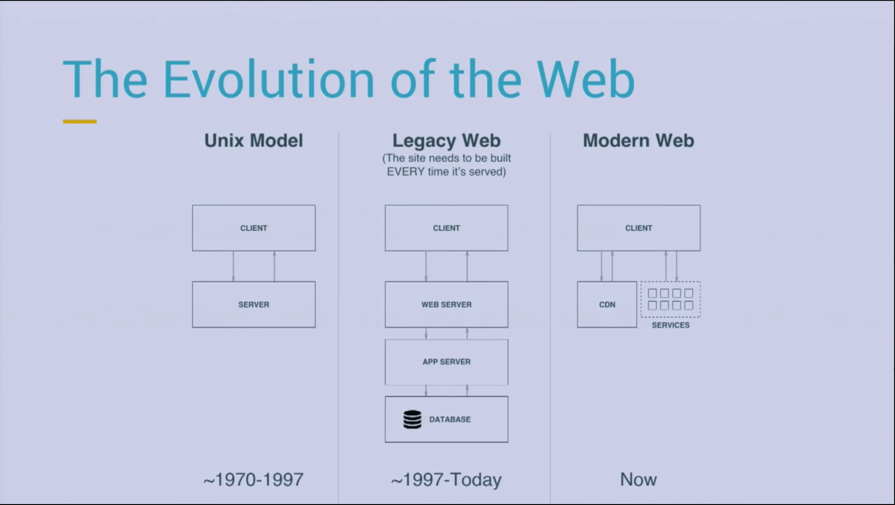
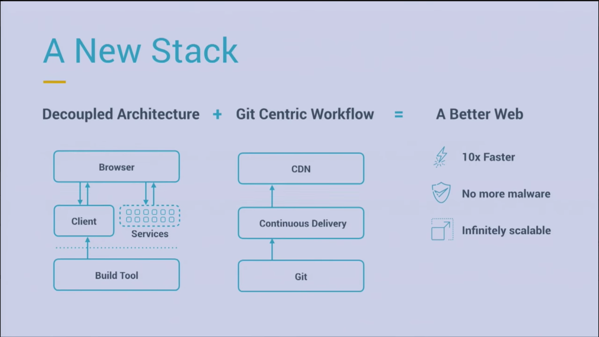

# Interesting components
- https://github.com/ealush/vest Vest describes your form validation declarative and is framework agnostic
- https://github.com/denoland/deno Javascript scripting instead of nodejs (better api)
- https://mswjs.io/ Api mocking service 
- https://www.gatsbyjs.com/ All in one package to build deploy react components

# Jamstack
  

  

# State of frontend
> https://tsh.io/state-of-frontend
 
|What|Description|Interesting|
|-|-|-|
|Hosting||Netfliy, Vercel, Heroku|
|Jamstack|Prerender page before request time (CDN), generate incrementally|Gatsby, Next.js (best)|
|Microfrontends||Web components|
|Design tools||Zeplin, Invision, Figma|
|Dead trends||Redus, CSS in JS, webcomponents, micro frontends, CSS modules, Atomic design|

# Static site generators
- Gatsby
- Next.js

Advantages
- you will get a performant website or application
- Good seo
- Exceptional Developer Experience: caching, code splitting, prefetching,

routing.
- Create React App in which you need to handle most of the configuration and architectural decisions by yourself

Nextjs seems to be better (not using graphql, better build performance)

> Now that NextJS supports next-generation static site rendering, I recommend using it instead of Gatsby. I believe that (almost) anything you can do with Gatsby, you can do with NextJS. And since NextJS is used more in industry, using NextJS in your next personal project can help you when you’re looking for a job.