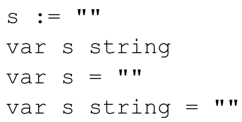

# Chapter 1: Introduction

- `go run helloworld.go` compile and run
- `go build helloworld.go` compiles and save compiled result
- If variable is not explicitly initialized, it is implicitly initialized to the zero value for its type
- Even the values of a map are default initialized with an empty value
- Ways to declare variable:     

Defer
- A defer statement pushes a function call onto a list. The list of saved calls is executed after the surrounding function returns.
- This means that when we defer a function, we are guaranteeing it’s execution at the end of its surrounding function.

Recover
- Recover is a function provided by Go which takes control of a panicking goroutine. 
- recover() can only be used inside deferred functions. 
- If you call recover()during normal flow, it will simply return nil. 
- However, if a goroutine is panicking, recover()will capture the panic value 
- To return a value during a panic, you must use a named return value.

Articles
- https://medium.com/swlh/simple-guide-to-panic-handling-and-recovery-in-golang-72d6181ae3e8