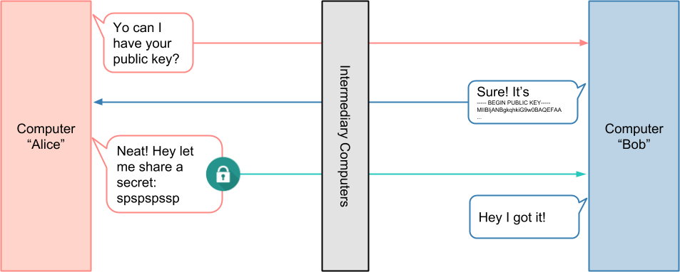
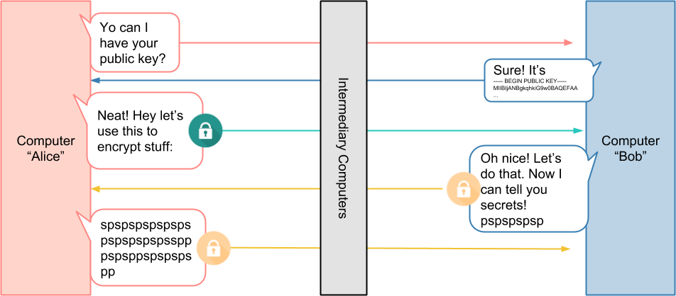

# Overview
- [Overview](#overview)
- [Public key cryptography](#public-key-cryptography)
  - [First step: asymmetric encryption](#first-step-asymmetric-encryption)
  - [Second step: symmetric key](#second-step-symmetric-key)
- [Problem: unauthorized server -> man in the middle attack](#problem-unauthorized-server---man-in-the-middle-attack)
  - [Solution](#solution)
- [Problem: unauthorized client](#problem-unauthorized-client)
- [Notes](#notes)
- [Questions](#questions)
- [Private key](#private-key)
- [Articles](#articles)
  

# Public key cryptography
- Public key which contains the reference to encode the data
- Private key, which contains the reference to decode the data

## First step: asymmetric encryption 

- Private data from client to server

## Second step: symmetric key
  
- Private data between client and server
- Client sends key to encrypt/decrypt data

# Problem: unauthorized server -> man in the middle attack
  

## Solution
- Client asks public key and certificate
- Validates with certificate authority if certificate is legit
  

# Problem: unauthorized client
  
- Server validates with certificate authority that client cert is valid
- Client sends its own certificate and symmetric key

  

# Notes
- Ensures that traffic is both secure and trusted in both directions between a client and server
- Allows requests that do not log in with an identity provider (like IoT devices) to demonstrate that they can reach a given resource

# Questions
- How validation?

# Private key
- Validation
- Compressing

# Articles
- https://developers.cloudflare.com/access/service-auth/mtls/
- https://medium.com/sitewards/the-magic-of-tls-x509-and-mutual-authentication-explained-b2162dec4401