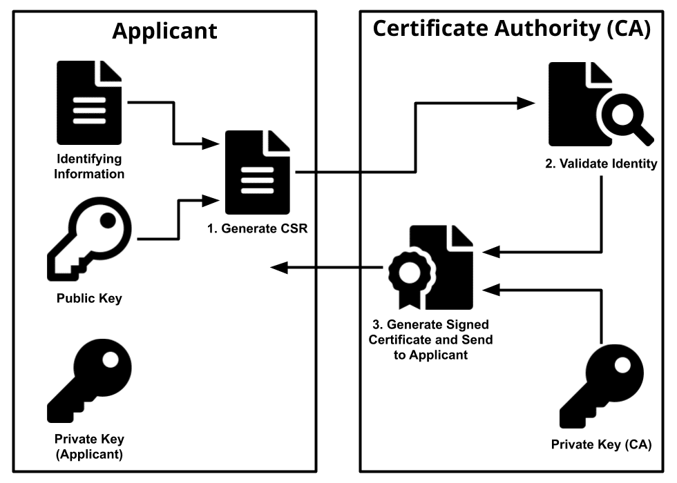
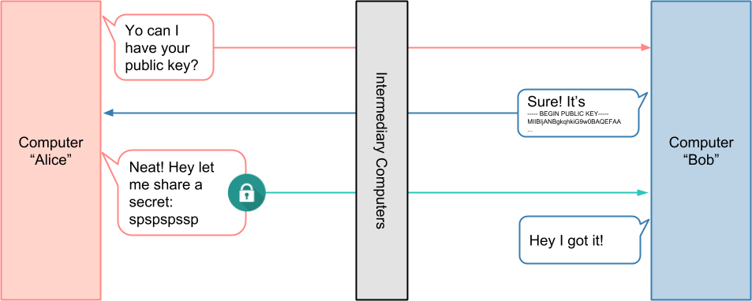
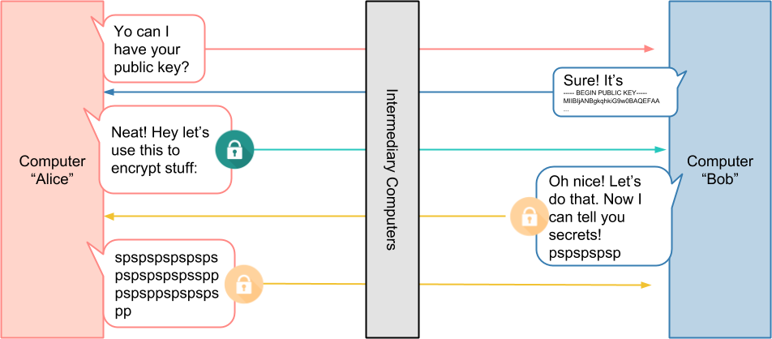
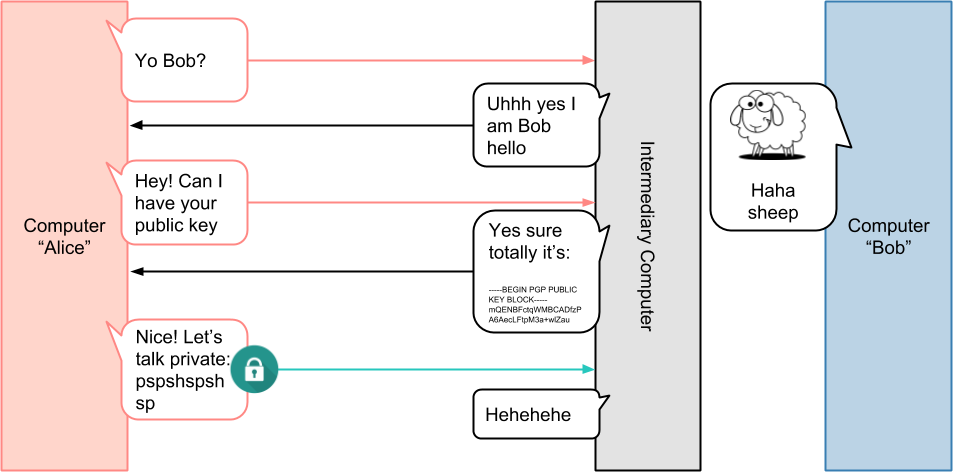
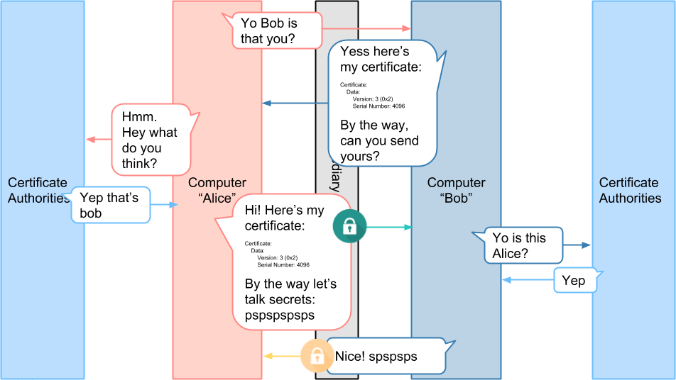
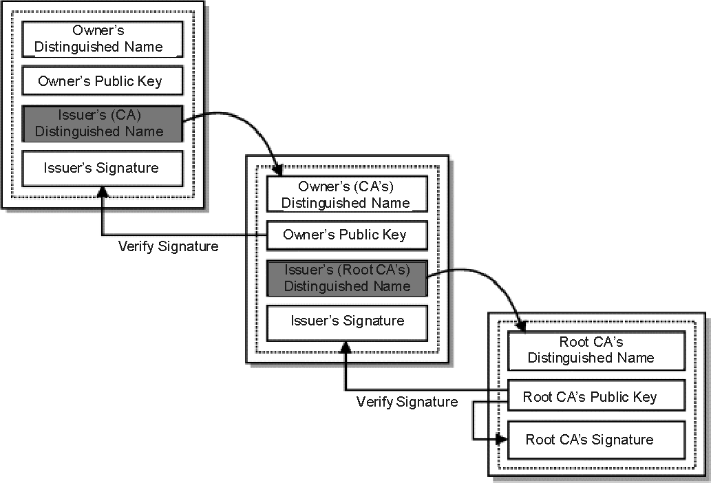

# Overview <!-- omit in toc -->
- [Types of keys](#types-of-keys)
- [Scenarios for assymmetric keys](#scenarios-for-assymmetric-keys)
- [Certificate Authority](#certificate-authority)
  - [Process](#process)
  - [In depth](#in-depth)
- [Notes](#notes)
- [Public key cryptography](#public-key-cryptography)
- [First step: asymmetric encryption](#first-step-asymmetric-encryption)
- [Second step: symmetric key](#second-step-symmetric-key)
- [Problem: unauthorized server -> man in the middle attack](#problem-unauthorized-server---man-in-the-middle-attack)
- [Solution](#solution)
- [Problem: unauthorized client](#problem-unauthorized-client)
- [Certificate chain](#certificate-chain)
- [Articles](#articles)

# Types of keys
- Assymmetric -> One party can read other party can write
- Symmetric -> Client / server can read and write data

# Scenarios for assymmetric keys
- Signing (certificates)
  - Server signs a document with private key
  - Client uses servers public available public key to decrypt document
  - Other servers cannot sign documents
- Encoding
  - Client uses public key to encode
  - Server uses private key to decode
  - Other clients cannot read data

# Certificate Authority
- Acts to validate the identities of entities
- Bind them to cryptographic keys through the issuance of electronic documents known as digital certificates

## Process
- Workstation sends a Certificate Signing request and public key
- Private key is always kept private
- CA signs a certificate with own private key
- Third party can cryptographically confirm the CA's signature via the CA's public key (available in browsers)
- 

## In depth
- A a public and private key 
- Public key wrapped up in a X.509 certificate (client needs both). 
- Certificate is self signed

# Notes
- Ensures that traffic is both secure and trusted in both directions between a client and server
- Allows requests that do not log in with an identity provider (like IoT devices) to demonstrate that they can reach a given resource
- mTLS: Mostly used for b2b > operational burden is limited, and security requirements are usually much higher
- TLS: Mostly used for customer facing environments
  
# Public key cryptography
- Public key which contains the reference to encode the data
- Private key, which contains the reference to decode the data

# First step: asymmetric encryption 
- Private data from client to server
- 

# Second step: symmetric key
- Private data between client and server
- Client sends key to encrypt/decrypt data
- 

# Problem: unauthorized server -> man in the middle attack
- 

# Solution
- Client asks public key and certificate
- Validates with certificate authority if certificate is legit
- 

# Problem: unauthorized client
- Server validates with certificate authority that client cert is valid
- Client sends its own certificate and symmetric key
- 

# Certificate chain
- Intermediate certificates has to be sent to client
- The root ca is installed on machine or in browser
- The browser will validate the signature with the public key of the higher certificate
- 

# Articles
- https://developers.cloudflare.com/access/service-auth/mtls/
- https://medium.com/sitewards/the-magic-of-tls-x509-and-mutual-authentication-explained-b2162dec4401
- https://codeburst.io/mutual-tls-authentication-mtls-de-mystified-11fa2a52e9cf
- https://security.stackexchange.com/questions/56389/ssl-certificate-framework-101-how-does-the-browser-actually-verify-the-validity