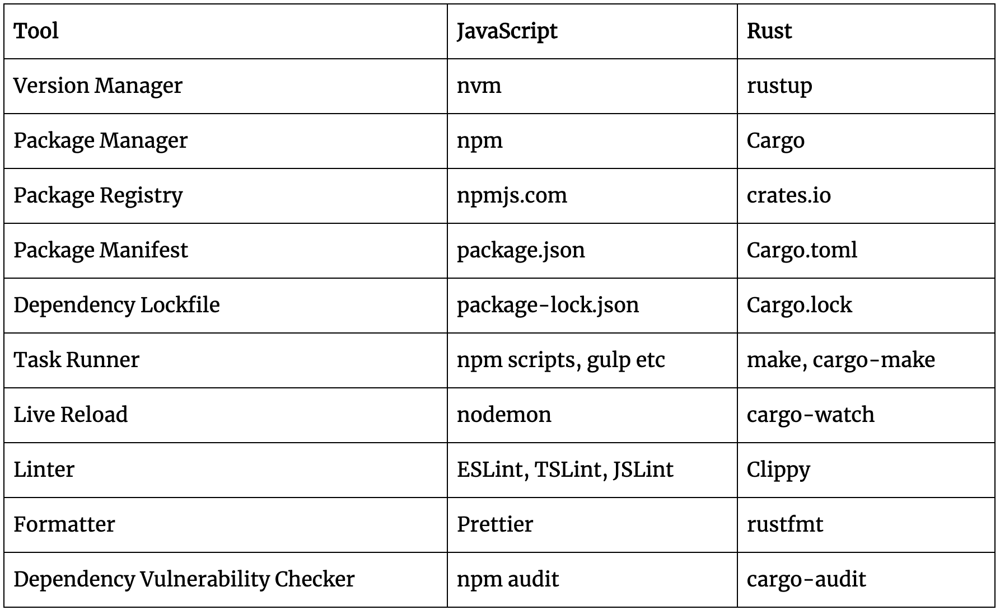
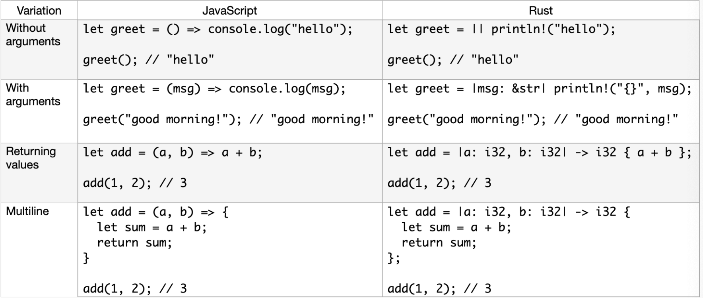

# Rust <!-- omit in toc -->

- [Resources](#resources)
- [Tooling](#tooling)
- [Simple datatypes](#simple-datatypes)
- [Objects](#objects)
- [Function/control flow](#functioncontrol-flow)
- [Enum](#enum)
- [Module](#module)
- [Error handling](#error-handling)
- [Concurrency](#concurrency)
- [Go vs rust](#go-vs-rust)

## Resources
- http://www.sheshbabu.com/posts/rust-module-system/
- 
## Tooling
  

## Simple datatypes
- Rust by default makes the variable immutable.
- Look similar to JavaScript’s const but JavaScript’s const doesn’t make variables immutable, it just makes the binding immutable. `let` vs `let mut`
- Const is a label as a “label” to a constant value. 
  - During compile time they get replaced by their actual values in all the places they are used.
  - Can be global
  - For port numbers, timeout values
- `String` is growable whereas `&str` is immutable and fixed size
- `Option<&str>`
- List with fixed size (`Array`) and other that can grow/shrink in size (`Vectors`)

## Objects
- Bag of data
```rust
struct Employee {
  name: String,
  age: i32,
  occupation: String,
}
```
- HashMap


## Function/control flow
  
- we can’t directly use map/filter/etc over vectors

```rust
let less_than_10 = |n: &i32| -> bool { *n < 10 };
```
- & reference var
- * dereference var
- The iter method instead of copying the elements in the vector, it passes them as references to the next adapter in the chain

## Enum
```rust
const DIRECTION = {
  FORWARD: "FORWARD",
  BACKWARD: "BACKWARD",
  LEFT: "LEFT",
  RIGHT: "RIGHT",
};
```

## Module
> We need to explicitly build the module tree in Rust, there’s no implicit mapping to file system

> The `mod` keyword declares a submodule
- You need need to declare a module in a different file!
- The compiler looks for `my_module.rs` or `my_module/mod.rs` in same directory

To run from a submodule:
- Use absolute path from crate to reach that 
- The `super` keyword in module path refers to the parent scope
- We can use the `use` keyword to bind the path to a new name or alias

## Error handling
```rust
enum Result<T, E> {
   Ok(T),
   Err(E),
}
```
- `unwrap();` to get the value
- `.expect("Can't read Cargo.toml");` same as unwrap but with context
- `eprintln` print to error channel
- `?` propagates the error to the calling function
- Returning a trait object `Box<dyn std::error::Error>` is very convenient when we want to return multiple errors


## Concurrency 

###### Using threads
- By adding the `move` keyword before the closure, we force the closure to take ownership of the values it’s using rather than allowing Rust to infer that it should borrow the values.
```rust
use std::thread;

fn main() {
    let v = vec![1, 2, 3];

    let handle = thread::spawn(move || {
        println!("Here's a vector: {:?}", v);
    });

    handle.join().unwrap();
}
```

###### Using messagepassing
- Do not communicate by sharing memory; instead, share memory by communicating.”
- A `channel` in programming has two halves: a transmitter and a receiver. The transmitter half is the `upstream location` where you put rubber ducks into the river, and the receiver half is where the rubber duck ends up `downstream`. 
- A channel is said to be closed if either the transmitter or receiver half is dropped.
- Receive will block the main thread’s execution and wait until a value is sent down the channel
```rust
use std::sync::mpsc;
use std::thread;

fn main() {
    let (tx, rx) = mpsc::channel();

    thread::spawn(move || {
        let val = String::from("hi");
        tx.send(val).unwrap();
    });

    let received = rx.recv().unwrap();
    println!("Got: {}", received);
}
```

###### Using sharedstate
- Using Mutexes to Allow Access to Data from One Thread at a Time
- a mutex allows only one thread to access some data at any given time.
- 

## Go vs rust
Choose Rust when:
- If performance is a necessity 
- If you want it to interoperate with C language. 
- When your developers need control on every detail of how the threads behave with the rest of the system, how the errors must be handled, it would be better to look into Rust use cases.  

Choose Go when:
- If readability is a must have requirement 
- If you wish to write codes faster
- If the focus is on uniformity and simplicity. 