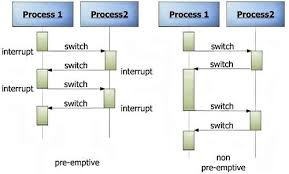
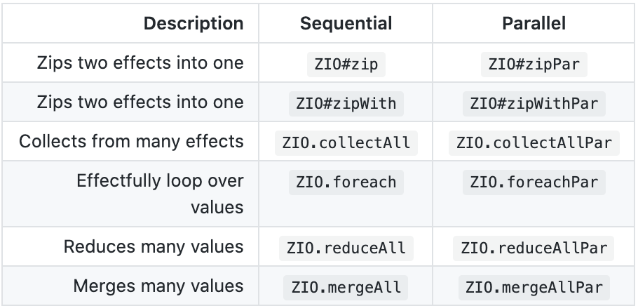

> https://zio.dev/docs/overview/overview_index

# Type aliases

|Type|Alias|Description|
|-|-|-|
|`UIO[A]`|`ZIO[Any,Nothing,A]`|No requirements, cannot fail, succeed with A|
|`URIO[R,A]`|`ZIO[R,Nothing,A]`|Requires R, cannot fail, succeed with A|
|`Task[A]`|`ZIO[Any,Throwable,A]`|No requirement, may fail with throwable, succeed with A|
|`RIO[R,A]`|`ZIO[R,Throwable,A]`|Requires R, may fail with throwable, succeed with A|
|`IO[E,A]`|`ZIO[Any,E,A]`|No requirements, may fail with E, succeed with A|

- Direct use of the ZIO data type is possible, although you may find it useful to create your own family of type aliases in different parts of your application.

# Creating effects
- `succeed` is intended for values which do not have any side effects
- If you know that your value does have side effects consider using ZIO.`effectTotal` for clarity. The value inside a successful effect constructed with ZIO.effectTotal will only be constructed if absolutely required.

# OptionT equivalent

```scala
val maybeId: IO[Option[Nothing], String] = ZIO.fromOption(Some("abc123"))
def getUser(userId: String): IO[Throwable, Option[User]] = ???
def getTeam(teamId: String): IO[Throwable, Team] = ???


val result: IO[Throwable, Option[(User, Team)]] = (for {
  id   <- maybeId
  user <- getUser(id).some
  team <- getTeam(user.teamId).asSomeError 
} yield (user, team)).optional 
```

- `.some` converts option of value to option of error 
- `.asSomeError` maps error (throwable) to option (some)
- `optional` converts option of error to option of value

# Function
A function A => B can be converted into a ZIO effect
```scala
val zfun: URIO[Int, Int] =
  ZIO.fromFunction((i: Int) => i * i)
```

# Side effects (not zio effects)

## Synchronous
- With `ZIO.effect` when throw exceptions
- With `ZIO.effectTotal` when not throw exceptions
- Prefer `effect` instead of `effectTotal` when in doubt
- You use `refineToOrDie` to treat the other errors as fatal

## Asynchronous
- Use `effectAsync`
```scala
val login: IO[AuthError, User] =
  IO.effectAsync[AuthError, User] { callback =>
    legacy.login(
      user => callback(IO.succeed(user)),
      err  => callback(IO.fail(err))
    )
  }
```

## Blocking Synchronous Side-Effects
- Use `zio.blocking` package with `effectBlocking` or `blocking`
- The resulting effect will be executed on a separate thread pool designed specifically for blocking effects.
- With `blocking` the zio side effect will be executed on a different thread pool
  
```scala
val sleeping =
  effectBlocking(Thread.sleep(Long.MaxValue))
```

or

```scala
def download(url: String) =
  Task.effect {
    Source.fromURL(url)(Codec.UTF8).mkString
  }

def safeDownload(url: String) =
  blocking(download(url))
```

# Basic operations
- Zipping: the effect on the left side is executed before the effect on the right side
- Symbolic alias `*>` and `<*` for zipLeft/zipRight

# Handling errors
- `ZIO.absolve` turns `ZIO[R, Nothing, Either[E, A]]` into a `ZIO[R, E, A]`
- `catchAll` vs `orElse`: with catchAll you get the error
- `fold` handles you succes and/or error

# Retry
- `.retry(Schedule...)` when failed
- `retryOrElse` retry and if that is not successful do something else
  
# Resource handling
- `ensuring` guarantees that an effects uses a finalizer
- `bracket` acquire effect; a release effect, and a use effect

# Concurrency

|Type|Description|Comment|
|-|-|-|
|Thread|Preemptive. Threads do not decide when to run and are forced to share the CPU. Scheduler (OS components) decides at any moment which thread can run and which has to sleep|Data integrity is a big issue because one thread may be stopped in the middle of updating a chunk of data. Operating system can take advantage of multiple CPUs and CPU cores by running more than one thread at the same time and leaving it up to the developer to guard data access|
|Fiber|Cooperative. Each thread, once running decides for how long to keep the CPU, and (crucially) when it is time to give it up so that another thread can use it|Fibers always start and stop in well-defined places, so data integrity is much less of an issue.Expensive context switches and CPU state changes need not be made.Will not take advantage of multiple CPUs or multiple CPU cores (nodejs)|
|Green thread|Scheduled by a virtual machine(VM) instead of natively. Enables multithreaded environemnts without relying on native OS||
  

ZIO fiber
- Consume almost no memory, have growable and shrinkable stacks, don't waste resources blocking, and will be garbage collected automatically
- Enables multitasking, even when operating in a single-threaded environment 

- `fork` executing on new fiber
- `join` get return value of the fiber
- `await` get information how the fiber completed
- `interrupt` kill fiber. you can fork interruption to continu without getting outcome
- `race` get first value
- `timout` option to return 
  


