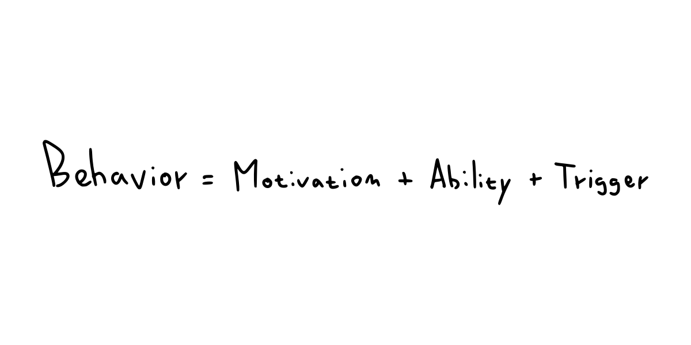

# Table of contents
This readme contains a summary of interesting blogs about architecture
- [Table of contents](#table-of-contents)
- [How to stop procrastinating by using the Fogg Behavior Model](#how-to-stop-procrastinating-by-using-the-fogg-behavior-model)
  - [Motivation](#motivation)
  - [Ability](#ability)
  - [Trigger](#trigger)

---

# How to stop procrastinating by using the Fogg Behavior Model
> https://www.deprocrastination.co/blog/how-to-stop-procrastinating-by-using-the-fogg-behavior-model

  

## Motivation
- Motivation doesn't come out of the blue
- Build motivation
  - Remind yourself of the why.
  - The important part is not only to know the reason, but to feel it, to get excited about it.
    - Link the task to a personal goal that you want to achieve. 
  - Add personal, meaningful reasons to the tasks that you put off. Make yourself remember why you took them on.

## Ability
- We're finally done with our procrastination, we'll often find that our work hasn't gotten any easier while we procrastinated.
- Turn down the difficulty dial by focusing on small steps
  - Identify the distinct parts that form the whole.
  - Create a simple timeline.
  
## Trigger
- Modern work often doesn't have a built-in trigger
- We have to make the decision to start—we have to trigger ourselves into action
- When you sit down to work, you can take your to-do list and give yourself 5-15 minutes to decide which task to start with.